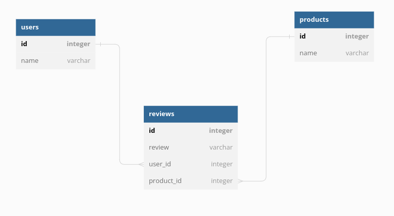

# README.md
## Overview

This repository contains a simple API developed using Sinatra and ActiveRecord. The API is related to a basic product review system where a user can review products and each review is related to a user and a product. The functionality of this API is built according to the given lab instructions and follows the CRUD principle.

## Getting Started

1. Clone this repository to your local machine.
2. Navigate to the root directory of the project in your terminal.
3. Run `bundle install` to install all the required dependencies.
4. Start the server using the command `bundle exec rake server`.
5. The API is now accessible at http://localhost:9292.

-In case you want ot test out the api's functionality, refer to the test section.

## API Endpoints

The API offers several routes for interacting with User, Product, and Review data.

### User Endpoints

- `GET /users/:id/reviews`: Returns all reviews from a user with the given id.
- `GET /users/:id/products`: Returns all products reviewed by a user with the given id.
- `GET /users/:id/favorite_product`: Returns the favorite product of a user (the product with the highest review rating).
- `DELETE /users/:user_id/reviews/:product_id`: Removes all reviews for a specific product from a user.

### Product Endpoints

- `GET /products/:id/reviews`: Returns all reviews for a product with the given id.
- `GET /products/:id/users`: Returns all users who have reviewed a specific product.
- `POST /products/:product_id/reviews`: Allows a user to leave a review for a specific product. Requires user_id, star_rating, and comment in the request body.
- `GET /products/:id/average_rating`: Returns the average rating for a product.

### Review Endpoints

- `GET /reviews/:id/user`: Returns the user who made a specific review.
- `GET /reviews/:id/product`: Returns the product that a specific review refers to.
- `GET /reviews/:id`: Prints a single review.

## Testing

This API does not come with a built-in testing suite. To test the functionality, use tools such as Postman or cURL to make requests to the above endpoints and observe the responses. You can also use the `rake console` or `seeds.rb` file to create sample data to test your models and associations.
1. Run the database migrations via `bundle exec rake db:migrate`.
2. Run the seed.rb file to populate the database via `bundle exec rake db:seed`.
3. Start the server using the command `bundle exec rake server`.
4. The API will be accessible at http://localhost:9292.

## Lab Requirements

This API meets the lab requirements as follows:

- It creates User, Product, and Review models with appropriate relationships.
- It allows users to create, read, and delete reviews.
- It allows users to retrieve all reviews for a product and all products reviewed by a user.
- It calculates the average rating for a product.
- It identifies a user's favorite product.
- It prints a single review.

## Contributing

Pull requests are welcome. For major changes, please open an issue first to discuss what you would like to change.

## API Usage

The API uses standard HTTP methods (GET, POST, DELETE) to interact with the database. Here are some example usages:

- **Getting a User's Reviews**:

    ```
    GET http://localhost:9292/users/1/reviews
    ```

- **Getting Products Reviewed by a User**:

    ```
    GET http://localhost:9292/users/1/products
    ```

- **Deleting a User's Reviews for a Specific Product**:

    ```
    DELETE http://localhost:9292/users/1/reviews/1
    ```

- **Getting All Reviews of a Product**:

    ```
    GET http://localhost:9292/products/1/reviews
    ```

- **Adding a Review for a Product**:

    ```
    POST http://localhost:9292/products/1/reviews
    ```

## Database Schema

The database consists of three tables: Users, Products, and Reviews. Reviews are a join table with a many-to-many relationship between Users and Products.



- `Users`: Has fields for `id` (primary key), and user information like `name`, `email`.
- `Products`: Has fields for `id` (primary key), and product information like `name`, `description`.
- `Reviews`: Has fields for `id` (primary key), `user_id` (foreign key), `product_id` (foreign key), `star_rating`, and `comment`.

## Built With

- [Sinatra](http://sinatrarb.com/) - The web framework used
- [ActiveRecord](https://guides.rubyonrails.org/active_record_basics.html) - ORM for database interactions

## Authors

- **Amos Wanene** - Initial work

## License

This project is licensed under the MIT License - see the [LICENSE.md](LICENSE.md) file for details.

## Notes

This project is for educational purposes and does not have a front-end UI, as the primary focus is to demonstrate the ability to build out a structured and functioning API in Sinatra.
